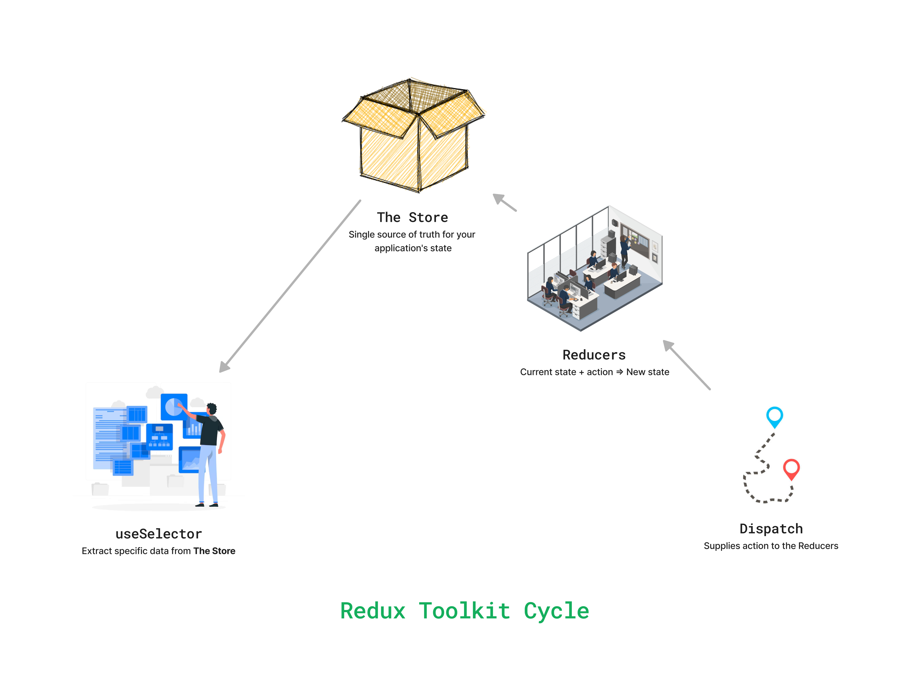

# React Notes

- **Road Map**
    
    ## *Why to learn React?*
    
    1. ~~hype, job, trend, build UI~~
    2. makes easy to manage and build complex front end
    
    ## *When should I learn React?*
    
    1. After learning JS
    2. most projects don’t need React in initial phase
    
    ## *Why React was created?*
    
    1. Ghost(Phantom) message problem
    2. No consistency in UI
    3. state → JS and UI → DOM (no sync)
    4. Early adopters ⇒ Khan Academy, Unsplash
    
    ## *Don’t learn React if:*
    
    You don’t know how JS works or DOM works
    
    ## *React Learning Process*
    
    | Method 1: GO in-depth | Method 2: By making projects |
    | --- | --- |
    | Babel, Fiber, virtual DOM, diff algo, hydration  | TODO, calculator, Github API |
    
    ## *React is a Library*
    
    → **framework v/s Library**
    
    ## *Topics to Learn*
    
    → core of React (state or UI manipulation, JSX)
    
    → component reusability 
    
    → Reusing component props
    
    → How to propagate changes (React Hooks)
    
    ## *Additional Addon to React*
    
    → Router (React doesn’t have Router)
    
    → state management (React doesn’t have state management)
    
    → Redux, Redux toolkit, Zustand, **context API**
    
    → class based component
    
    → legacy code 😟
    
    → **BAAS Apps (Firebase, SupaBase)**
    
    → social media clone, e-commerce app, …
    
    ## *After React*
    
    1. **Backend**
    2. React is not a complete solution in most cases 
        
        → no SEO, browser rendering of JS, no routing 😟
        
    3. Frameworks
        
        → NEXT js, Gatsby, Remix
        
    
- **Building a React Project**
    
    https://vitejs.dev/
    
    You can create a default React project with: 
    
    ```
    npx create-react-app <your-project-name>
    ```
    
    with `Vite` we can use: 
    
    ```
    npm create vite@latest
    ```
    
    Then to install all dependencies:
    
    ```
    npm install
    ```
    
    | Feature | Using Vite | Not Using Vite |
    | --- | --- | --- |
    | Development Speed | Faster development speeds | Slower development cycles |
    | Build Performance | More efficient production builds | Potentially less efficient production builds |
    | Configuration | Straightforward configuration with sensible defaults | More complex setup and configuration |
- **React Flow and Structure**
    
    The normal convention for `.jsx` file is to export only one element. So the only way to return multiple elements is to wrap it in a parent like `<div>`. For e.g.:
    
    ```jsx
    return (
        <div>
          <Chai />
          <p>test para</p>
        </div>
      )
    ```
    
    The wrapping of elements in such a manner with parents like `<div>` was such a common problem in React that they eventually allowed developers to wrap them with the empty `<>` tag. This is called a ***Fragment.***
    
    So the above code would look something like:
    
    ```
    return (
        <>
          <Chai />
          <p>test para</p>
        </>
      )
    ```
    
    ### Conventions
    
    1. The name of all ***components*** must start with *capitalized letters*.
        
        ```jsx
        function Chai() {   // not chai()
            return(
                <h3>chai aur React</h3>
            )
        }
        ```
        
    2. Another good practice is to start the name of all ***files containing components*** with *capitalized letters*. So `Chai.js` instead of `chai.js` 
    3. Some libraries like `Vite` will force to name all ***files returning components*** with `.jsx` extension. 
    
- **Parsing in React (Babel)**
    
    React uses its own bundler like `Babel`, which behind the scene improves and upgrades the syntax. Its main purpose is to ***parse the code*** written in our ***React Components*** from **`HTML`** format to create **`React Objects`** that the library can understand and use.
    
    ```html
    <a href="https://www.google.com" target="_blank">Click me to visit Google</a>
    ```
    
    The above HTML element is parsed into a React object, which looks something like this:
    
    ```jsx
    const reactElement = {
        type: "a",
        props: {
            href: "https://www.google.com",
            target: "_blank",
        },
        children: "Click me to visit Google",
    }
    ```
    
    ---
    
    The reason why this wouldn't work is that, ReactElement is a custom implementation of React objects and can only be understood by a custom renderer builty specifically for it. 
    
    ```jsx
    const ReactElement = {
      type: "a",
      props: {
        href: "https://www.google.com",
        target: "_blank",
      },
      children: "Click me to visit Google",
    };
    
    ReactDOM.createRoot(document.getElementById("root")).render(ReactElement);
    ```
    
    The render() function provided by React will not be able to understand the meaning(names) of all the different keys in our custom implementation. Since it was written for React objects and not for our custom implementation of React objects.
    
    For e.g ⇒ We've used the key 'type' to refer to the tag name of the element, but in React's own implementation, that could have been 'tagName', etc. So the render() function would never be able to understand this. There is a particular type of syntax to the parameters the render() function expects.
    
- **React Hooks**
    
    ### React Hooks: A Brief Overview
    
    React hooks, allow *function components* to *access state and lifecycle features* without using classes. Key hooks include `useState`, `useEffect`, `useContext`, `useReducer`, and `useRef`.
    
    ### What is `useState`?
    
    `useState` is a React hook that lets you add state to function components. By calling `useState`, you declare a state variable and a function to update it. This allows functional components to maintain local state.
    
    ### Syntax
    
    ```jsx
    let [state, setState] = useState(initialState);
    ```
    
    - **`state`**: The current state value.
    - **`setState`**: A function that updates the state value.
    - **`initialState`**: The initial value of the state, which can be a primitive, object, array, or any data type.
    
    ### Key Points
    
    - **Multiple State Variables**: You can call `useState` multiple times to declare multiple state variables.
    - **Initial State Function**: If the initial state requires complex computation, you can pass a function to `useState`. This function will be executed only once during the initial render.
    - **Preserving State**: The state is preserved between re-renders, making it a powerful way to manage dynamic data in function components.
    - **Propagating Changes in the UI**: When you update the state using `useState`, React automatically triggers a re-render of the component where the state is used. This re-render updates the component's UI to reflect the new state.
- **React Fibre and Virtual DOM**
    
    ***Documentation:*** https://github.com/acdlite/react-fiber-architecture
    
    ### **Introduction**
    
    React Fiber is an ongoing reimplementation of React's core algorithm. It is the culmination of over two years of research by the React team.
    
    The goal of React Fiber is to increase its suitability for areas like animation, layout, and gestures. Its headline feature is **incremental rendering**: the ability to split rendering work into chunks and spread it out over multiple frames.
    
    Other key features include the ability to pause, abort, or reuse work as new updates come in; the ability to assign priority to different types of updates; and new concurrency primitives.
    
    ### **What is reconciliation?**
    
    ***reconciliation:*** The algorithm React uses to diff one tree with another to determine which parts need to be changed.
    
    ***update:*** A change in the data used to render a React app. Usually the result of `setState`. Eventually results in a re-render.
    
    The central idea of React's API is to think of updates as if they cause the entire app to re-render. This allows the developer to reason declaratively, rather than worry about how to efficiently transition the app from any particular state to another (A to B, B to C, C to A, and so on).
    
    Actually re-rendering the entire app on each change only works for the most trivial apps; in a real-world app, it's prohibitively costly in terms of performance. React has optimizations which create the appearance of whole app re-rendering while maintaining great performance. The bulk of these optimizations are part of a process called **reconciliation**.
    
    ***Reconciliation* is the algorithm behind what is popularly understood as the *"virtual DOM"*.** A high-level description goes something like this: when you render a React application, a tree of nodes that describes the app is generated and saved in memory. This tree is then flushed to the rendering environment — for example, in the case of a browser application, it's translated to a set of DOM operations. When the app is updated (usually via `setState`), a new tree is generated. The new tree is diffed with the previous tree to compute which operations are needed to update the rendered app.
    
    Although Fiber is a ground-up rewrite of the reconciler, the high-level algorithm described in the React docs will be largely the same. The key points are:
    
    - Different component types are assumed to generate substantially different trees. React will not attempt to diff them, but rather replace the old tree completely.
    - Diffing of lists is performed using keys. Keys should be "stable, predictable, and unique.
    
    **The key points are:**
    
    - In a UI, it's not necessary for every update to be applied immediately; in fact, doing so can be wasteful, causing frames to drop and degrading the user experience.
    - Different types of updates have different priorities — an animation update needs to complete more quickly than, say, an update from a data store.
    - A push-based approach requires the app (you, the programmer) to decide how to schedule work. A pull-based approach allows the framework (React) to be smart and make those decisions for you.
    
    We've established that a **primary goal of Fiber is to enable React to take advantage of scheduling.** Specifically, we need to be able to
    
    - pause work and come back to it later.
    - assign priority to different types of work.
    - reuse previously completed work.
    - abort work if it's no longer needed.
- **useEffect() and useCallback()**
    
    ### `useEffect()`
    
    The `useEffect` Hook allows you to perform side effects in your components. Some examples of side effects are: fetching data, directly updating the DOM, and timers. `useEffect` accepts two arguments. The second argument is optional. `useEffect(<function>, <dependency>)` 
    
    `useEffect` runs on every render. That means that when the count changes, a render happens, which then triggers another effect. There are several ways to control when side effects run. We should always include the second parameter which accepts an array. We can optionally pass dependencies to `useEffect` in this array.
    
    ```jsx
    useEffect(() => {
      //Runs on every render
    });
    ```
    
    ```jsx
    useEffect(() => {
      //Runs only on the first render
    }, []);
    ```
    
    ```jsx
    useEffect(() => {
      //Runs on the first render
      //And any time any dependency value changes
    }, [prop, state]);
    ```
    
    ### `useCallback()`
    
    `useCallback` is a React Hook that lets you cache a function definition between re-renders (***memoization***). 
    
    Think of ***memoization*** as caching a value so that it does not need to be recalculated. This allows us to isolate resource intensive functions so that they will not automatically run on every render.
    
    **Parameters**
    
    - `fn`: The function value that you want to cache. React will return (not call!) your function back to you during the initial render. On next renders, React will give you the same function again if the `dependencies` have not changed since the last render. Otherwise, it will give you the function that you have passed during the current render, and store it in case it can be reused later. React will not call your function. The function is returned to you so you can decide when and whether to call it.
    - `dependencies`: The `useCallback` Hook only runs when one of its dependencies update. This can improve performance.
    
    On the initial render, `useCallback` returns the `fn` function you have passed. 
    
    During subsequent renders, it will either return an already stored `fn`  function from the last render (if the dependencies haven’t changed), or return the `fn` function you have passed during this render.
    
- **React Router**
    
    ### Installation
    
    https://v5.reactrouter.com/web/guides/quick-start
    
    ```bash
    npm install react-router-dom
    ```
    
    Anchor tag or `<a>` tag is not used in React as it refreshes the whole page which defeats the whole concept of React, that's why `Link` tag is used in react which is imported from `react-router-dom` 
    
    **Create a Router:**
    
    ```jsx
      const router = createBrowserRouter(
        createRoutesFromElements(
          <Route path="/" element={<Layout />}>
            <Route path="" element={<Home />} />
            <Route path="about" element={<About />} />
            <Route path="contact" element={<Contact />} />
            <Route path="user/:userid" element={<User />} />
          </Route>
        )
      )
      
      ReactDOM.createRoot(document.getElementById("root")).render(
      <React.StrictMode>
        <RouterProvider router={router} />
      </React.StrictMode>
    )
    ```
    
    ```jsx
    function Layout() {
      return (
        <>
          <Header />
          <Outlet />
          <Footer />
        </>
      )
    }
    ```
    
- **Context API**
    
    ### What is Context API?
    
    The Context API in React is a way to manage state globally. It allows you to create global variables that can be passed around the app without having to explicitly pass props through every level of the component tree.
    
    ### Why Use Context API?
    
    - **Global State Management**: Ideal for managing state that needs to be accessed by multiple components at different levels.
    - **Prop Drilling Elimination**: Reduces the need to pass props through multiple layers of components, simplifying code and improving maintainability.
    - **Centralized State Management**: Easier to manage and update the state from a central place.
    
    ### Steps to Use Context API
    
    1. **Create the Context**
    Here, `ThemeContext` is created, which has the property `Provider`. We also create a custom hook `useTheme` to simplify the context consumption.
        
        ```jsx
        import { createContext, useContext } from "react"
        
        export const ThemeContext = createContext({
            themeMode: "light",
            darkTheme: () => {},
            lightTheme: () => {},
        })
        
        export const ThemeProvider = ThemeContext.Provider
        
        export default function useTheme() {
            return useContext(ThemeContext)
        }
        ```
        
    2. **Create a Provider Component**
        
        A provider component wraps around parts of your application where you want the context to be available. It supplies the context value to its child components.
        
        ```jsx
        // App.jsx
        const [themeMode, setThemeMode] = useState("light")
        
        const lightTheme = () => {
          setThemeMode("light")
        }
        
        const darkTheme = () => {
          setThemeMode("dark")
        }
        
        // ....other code
        return (
            <ThemeProvider value={{ themeMode, lightTheme, darkTheme }}>
            {/* other children which have access to themeMode, etc. */}
            </ThemeProvider>
        )
        ```
        
        In the `App` component:
        
        - `useState` manages the theme state.
        - `ThemeProvider` wraps the application and provides the `themeMode`, `lightTheme`, and `darkTheme` to the child components.
    3. **Consume the Context**
        
        To access the context values in child components, use the `useTheme` hook.
        
        ```jsx
        // ThemeBtn child component
        export default function ThemeBtn() {
          const { themeMode, lightTheme, darkTheme } = useTheme();
        
          const onChangeBtn = (e) => {
            const darkModeStatus = e.target.checked;
            darkModeStatus ? darkTheme() : lightTheme();
          };
          
          // ....other code
        }
        ```
        
        ***Tailwind config*** for setting dark mode through classes
        
        ```jsx
        /** @type {import('tailwindcss').Config} */
        export default {
            content: ["./index.html", "./src/**/*.{js,ts,jsx,tsx}"],
            darkMode: "class",
            theme: {
                extend: {},
            },
            plugins: [],
        }
        ```
        
- **Redux Toolkit**
    
    https://redux-toolkit.js.org/
    
    ### What is Redux Toolkit?
    
    **Redux-toolkit is a state management library** that allows you to manage the state of your JavaScript applications more efficiently and predictably.
    
    It works by keeping track of your application's state in a single place called the ***"store".***
    
    Let's say you're building an e-commerce site. You may need to keep track of the items in a user's cart, their payment information, and their shipping details.
    
    Instead of passing this information from component to component using props, Redux allows you to store them in one central location where they can be easily accessed and updated. This makes it easier to manage complex states and keep your application organized.
    
    It's important to note that **Redux is not limited to React** and you can use it with other frameworks or even vanilla JavaScript.
    
    ### Why Should I Use Redux Toolkit?
    
    Redux Toolkit can help simplify the state management process, especially when dealing with complex and interconnected components. Here are some reasons why you might want to use Redux in your application:
    
    - **Centralized state management:** With Redux, you can maintain the state of your entire application in a single store, making it easier to manage and access data across components.
    - **Predictable state updates:** Redux has a clear flow of data, which means changes to the state can only happen when you create a **reducer** and send it through Redux. This makes it easy to understand how your application's data will change in response to user actions.
    - **Easier debugging:** With Redux DevTools, you have a clear record of all the changes to your application's state. This makes locating and fixing issues in your code easier, saving you time and effort in the debugging process.
    - **Better performance:** By minimizing the number of state updates and reducing the need for prop drilling, Redux helps improve your application's performance.
    
    ### How Does Redux Toolkit Work?
    
    Redux Toolkit enables you to maintain a single centralized store that manages the state of your entire application. All components in your application can access this store and update or retrieve data from it as needed. The key components that enable this centralized approach to state management are:
    
    - **Store**
    - Slices
    - **Reducers**
    - Dispatch
    
    Let’s explore the role of each one:
    
    ### The Store
    
    The Redux store is like a giant container that holds all the data for your application.
    
    
    
    Think of the store as a box with different compartments for different data types. You can store any data you want in these compartments, and it can hold various kinds of data, such as strings, numbers, arrays, objects, and even functions. The store is the single source of truth for your application's state, meaning that any component in your application can access it to retrieve and update data.
    
    With Redux Toolkit, you configure the store using the `configureStore` function, which sets up the store with good defaults and enables Redux DevTools:
    
    ```jsx
    import { configureStore } from '@reduxjs/toolkit';
    import counterReducer from './features/counter/counterSlice';
    
    const store = configureStore({
      reducer: {
        counter: counterReducer,
      },
    });
    
    	export default store;
    ```
    
    ### Slices
    
    A slice is a collection of Redux reducer logic and actions for a single feature of your application. Redux Toolkit provides the `createSlice` function to create a slice:
    
    ```jsx
    import { createSlice } from '@reduxjs/toolkit';
    
    const counterSlice = createSlice({
      name: 'counter',
      initialState: { value: 0 },
      reducers: {
        increment: (state) => {
          state.value += 1;
        },
        decrement: (state) => {
          state.value -= 1;
        },
      },
    });
    
    export const { increment, decrement } = counterSlice.actions;
    export default counterSlice.reducer;
    
    ```
    
    ### Reducers
    
    A reducer is a function that takes the current state of an application and an action as arguments and returns a new state based on the action. In Redux Toolkit, reducers are defined within slices.
    
    ```jsx
    const counterSlice = createSlice({
      name: 'counter',
      initialState: { value: 0 },
      reducers: {
        increment: (state) => {
          state.value += 1;
        },
        decrement: (state) => {
          state.value -= 1;
        },
      },
    });
    
    export default counterSlice.reducer;
    ```
    
    ### Dispatch
    
    In Redux Toolkit, you use the `dispatch` 
    
    . The store runs the action through the reducer to update the state accordingly.
    
    
    
    ```jsx
    import { useDispatch } from 'react-redux';
    
    const dispatch = useDispatch();
    dispatch(increment());
    ```
    
    You can think of dispatch as a mail carrier who delivers mail to different departments in a large company. Just like how the mail carrier delivers mail to different departments, **dispatch delivers actions to various reducers in your Redux-toolkit store. Each reducer is like a department in the company that processes the mail and updates its own part of the company's data.**
    
    
    

https://react.dev/